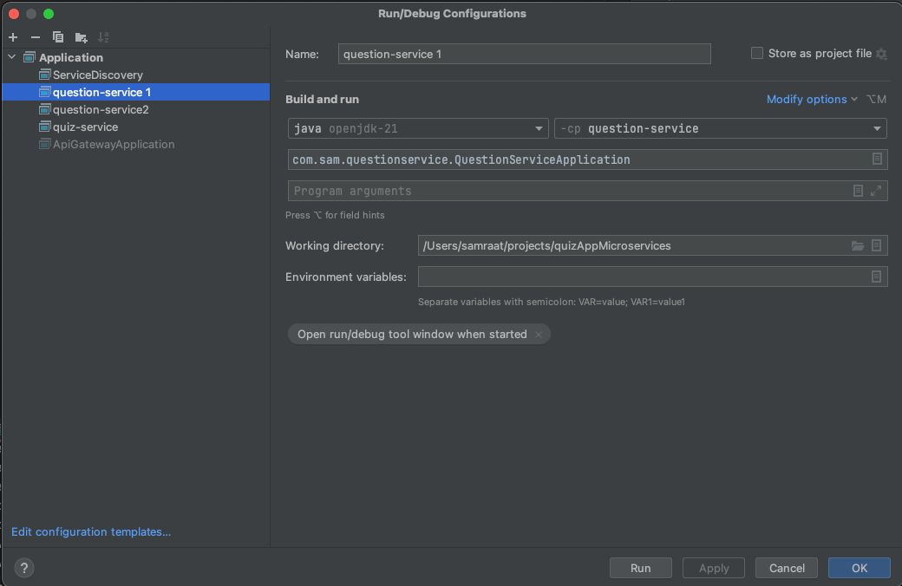

Overall Project Flow

API GATEWAY -> QUIZ SERVICE -> QUESTION SERVICE

(EUREKA DISCOVERY SERVER) - IT WILL REGISTER ALL THE APPLICATIONS TO BE DISCOVERED BY EACH OTHER

Api Gateway Running port - 8765

Services Registered for Discovery with Eureka Server (itself running at 8761)

Quiz Service will call Question Service internally

Run Configurations

# QuizAppMicroservices
